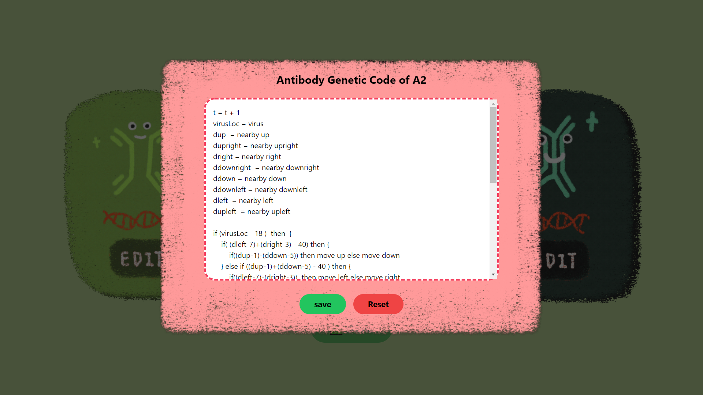
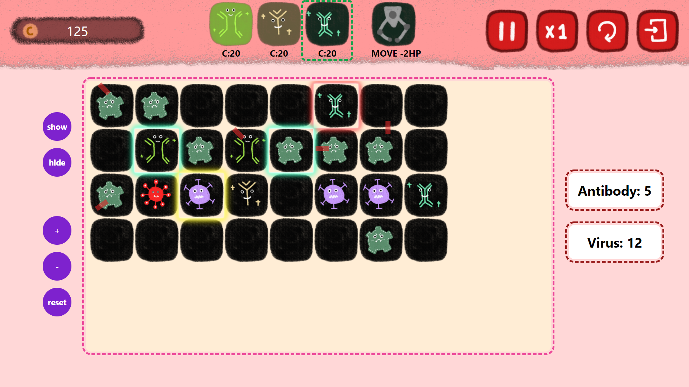

# Covid Antibody Response and Infection Neutralization (CARIN) by Expensive Pig Group

Amidst the pandemic, the human bodies have responded!  Upon the arrival of Covid viruses, you as a player will be controlling the immune system to eliminate the incoming viruses before they destroy your body.

## About

This course project is a part of object-oriented programming course (CPE261200), offered by Department of Computer Engineering, Chiang Mai University. This project was developed according to [project's specification](https://docs.google.com/document/d/1jVgXM8ejPN71PJDd9NYCvBU_0K0DzwZMcgVDgPRIdkk/edit?usp=sharing) by Aj.Chinawat Isaradisaikul. It is a single-player online strategy game. It features genetic code parser and interpreter for game's characters, and multi-threaded server support for concurrent playing games. The genetic code grammar was provided by Aj.Chinawat and is in the project's spec. 

### Tech Stack
**Back-end:** Java17, Spring WebSocket with STOMP, Spring Web, Lombok, SockJS  
**Front-end:** React with TypeScript, CSS, HTML, JavaScript, tailwindcss

### [Project's Design Doc (Final Report)](https://docs.google.com/document/d/1wcnEaYMlcRI0ZORnsJxGjPfPv-qUeSbBCCVP_qfu0Z4/edit?usp=sharing)

## Screenshots

## How to run locally?

- Start back-end server by `gradlew bootRun` at root directory.
- Start front-end server by `npm start` at carin-frontend directory.

